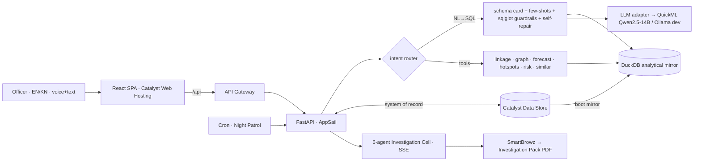

# ANVESHAK (ಅನ್ವೇಷಕ) — AI Crime Intelligence & Investigation Platform

**KSP Datathon 2026 · Challenge 1: Intelligent Conversational AI for KSP Crime Database · Team Zen**

ANVESHAK is an AI investigation platform over the Karnataka State Police FIR
database. Officers query crime records in **Kannada or English, by voice or text** —
and every answer is grounded in verified SQL with visible case-ID evidence. Beyond
conversation, ANVESHAK works cases: a **serial-crime linkage engine** fingerprints
modus operandi across district boundaries, a **six-agent investigation cell**
assembles court-ready Investigation Packs with ranked, evidence-cited leads, a
**crime knowledge graph** answers multi-hop network questions, and a **Night Patrol**
sweep raises proactive lead cards before anyone asks.

---

## Architecture



**Two data layers (ADR-1):** Catalyst Data Store is the system of record; on AppSail
startup we mirror the core tables into an embedded **DuckDB** database for sub-second
analytics. All NL→SQL and tools run on DuckDB. **Deterministic tools, LLM narrates
(ADR-2):** the LLM never computes a statistic — it routes to typed tools and composes
their verified outputs, so every number traces to a tool result and a case-ID set.

## The six pillars

1. **Serial Crime Linkage Engine** — MO fingerprinting via multilingual narrative
   embeddings + structured features (vehicle/target/time-of-day/geo), weighted cosine,
   HDBSCAN, and a 180-day / 120-km spatiotemporal filter. Discovers cross-district
   series cold.
2. **AI Investigation Cell** — a fixed 6-agent pipeline (Case Officer → Records Analyst
   → Network Specialist → Crime Historian → Legal Advisor → Forecaster) that streams
   its reasoning over SSE and assembles a court-ready Investigation Pack.
3. **CrimeGraph** — NetworkX knowledge graph over people/cases with Louvain communities;
   `ego_network`, `path_between`, `community_of` for multi-hop questions.
4. **Night Patrol** — spike (residual-z), series-growth and repeat-offender detectors
   producing ranked Lead Cards.
5. **Conversational floor** — bilingual (EN + Kannada) chat with browser voice, verified
   NL→SQL, and an evidence drawer (SQL + rows + case IDs) on every answer.
6. **Court-Ready Outputs** — Investigation Pack (HTML → SmartBrowz PDF).

## Measured results (synthetic dataset, seed 42)

| Metric | Result | How measured |
|---|---|---|
| Dataset | 15,405 FIRs · 31 districts · 248 stations · 2023–2026 | `data_engine` |
| NL→SQL accuracy | **76.7% overall** (EN 82.2%, KN 60.0%) with the local 7B dev model; gold-vs-gold 100% | `eval/harness.py`, execution-match over 60 bilingual questions |
| Serial linkage (SH-07) | **precision 0.86 · recall 12/14** · SP-2 not merged | `eval/linkage_test.py` vs planted truth |
| Forecast (burglary) | backtest MAE **1.83** vs seasonal-naive **1.75** (competitive) | `eval/tools_test.py`, SARIMA weekly + holdout |
| Repeat-offender risk | Suresh B **0.83** (recency/frequency/gravity/centrality) | `eval/tools_test.py` |
| Night Patrol | Whitefield spike + Suresh cluster fire on planted anomalies | `eval/patrol_test.py` |

*The linkage ground truth (`data_engine/planted/*.yaml`) is intentionally public so the
precision/recall numbers above are independently verifiable.*

## Bias & data-protection policy (ADR-9)

- **Synthetic only.** No real case data or real persons. Protected attributes
  (religion/caste/occupation) are drawn from coarse, neutral distributions and are
  **never correlated with crime by construction**.
- **Never a feature.** Religion/caste/occupation are never used in linkage, risk
  scoring, or forecasting — asserted by a unit test (`test_adr9_no_protected_attributes`).
  They may appear only in explicit, aggregate sociological breakdowns.

## Reproduce locally

```bash
python -m venv .venv && . .venv/Scripts/activate   # (Linux/Mac: bin/activate)
pip install -r requirements-dev.txt
python -m data_engine.build          # builds build/anveshak.duckdb (15k cases + embeddings)
python -m uvicorn backend.main:app --port 8000     # backend
cd frontend && npm install && npm run build && npm run dev   # frontend on :5173
pytest                               # backend + data + tool tests
python -m eval.harness               # NL→SQL gold-vs-gold sanity (100%)
```

**LLM backend (ADR-4):** set `LLM_BACKEND=quickml` with the Catalyst QuickML LLM-Serving
endpoint (Qwen 2.5-14B Instruct) for the deployed app; `LLM_BACKEND=ollama`
(`qwen2.5:7b`) is the local dev fallback. No external inference API is ever called from
the deployed app.

## Catalyst services

AppSail (FastAPI backend) · Web Client Hosting (SPA) · API Gateway · Data Store
(system of record) · NoSQL (graph snapshots) · QuickML (LLM serving) · SmartBrowz
(pack PDF) · Cron (Night Patrol) · Signals + Mail (lead digests) · Auth (SHO/SP/SCRB
roles) · Cache · Stratus (pack storage).
